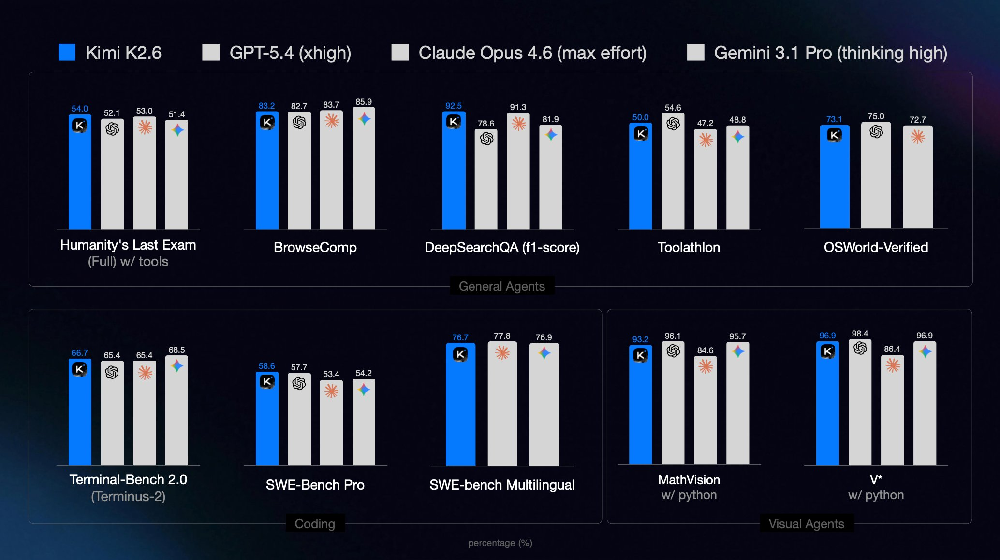

# Kimi K2.6 Autonomous Desktop IDE 

**Kimi K2.6** — is not just a code editor, it is an autonomous software factory on your desktop. We have integrated the latest Kimi 2.6 model from Moonshot AI with the Agent Swarm architecture to implement the Vibe Coding concept at an industrial level. The system allows turning high-level ideas into ready-to-use full-stack applications in a single generation cycle, using the parallel work of 300 specialized sub-agents.

  

## 🏗 Architecture "The Hive": How 300 Agents Work

Unlike standard AI coders that write code linearly (line by line), Kimi K2.6 deploys a hierarchical structure of a "Smart Swarm":

* **The Architect (1 agent):** Analyzes your prompt ("vibe"), designs the database schema, selects the technology stack, and creates the project tree structure.
* **The Frontend Squad (120 agents):** Create interface components in parallel. While one agent layouts the Navbar, others simultaneously write form logic, animations, and responsive styles.
* **The Backend Core (100 agents):** Deal with server logic, setting up API endpoints, payment system integration, and authorization logic.
* **The QA Hive (50 agents):** Write Unit tests in real-time and conduct load testing of the written modules.
* **The Reviewers (29 agents):** Check the code for compliance with security patterns, cleanliness (Clean Code), and absence of dependency conflicts.

This approach allows assembling a complex project (for example, a marketplace clone or a CRM system) in 3–5 minutes versus several hours with regular LLMs.

## 💎 Key Advantages and Innovations

### 🎬 Cinematic Vibe Engine
The "Cinematic" technology in Kimi 2.6 allows the model to generate interfaces with "visual taste." These are not dry templates, but modern, animated, and high-conversion websites. The system itself selects the palette, fonts, and UX patterns based on the project mood you described.

### 🧠 Deep Context Reasoning (256K)
Thanks to a giant context window, Kimi-Code "sees" the entire project as a whole. This eliminates the problem where the AI forgets what it wrote in another file. The system automatically maintains type consistency (TypeScript), synchronizes DB migrations with the backend, and updates documentation on the fly.

### 🦀 OpenClaw Native Bridge
We have built-in full support for OpenClaw and Claude Code protocols. This means you can use familiar CLI tools to manage agents, but instead of the expensive API from Anthropic, all the magic happens inside Kimi-Code using local resources and Swarm parallelism.

### 📦 Zero-Cloud Infrastructure
The application is delivered as a standalone binary file (EXE/DMG), inside which there are already isolated runtimes for Node.js, Python, and Go. You don't need to install dependencies — just run the installer, and you are ready for deployment.

---

| Function | Cursor / Windsurf | GitHub Copilot | Kimi K2.6 (Ours) |
| :--- | :--- | :--- | :--- |
| **Generation Method** | File-by-file (linear) | Autocomplete | 🚀 Parallel Swarm |
| **Autonomy** | Requires hints | Guided | Full Full-stack cycle |
| **Context** | 32k - 128k | Limited | 256k (Real-time) |
| **Testing** | Manual launch | None | Automatic QA Hive |
| **Price per project** | $5 - $20 (tokens) | Subscription | Free / Local Optimization |
| **Installation** | Plugin / IDE | Plugin | Standalone EXE / DMG |

---

## 🚀 Quick Start

Just download the official build for your system. We guarantee "out of the box" operation without configuring environment variables.

* 📥 [Download Kimi-K2.6_x64.7z (Windows 10/11)]()
* 📥 [Download Kimi-K2.6.dmg (macOS silicon)]()

---

## 🛠 Technical Modules of the System

* **Vibe-to-Code Transpiler:** A natural language processing module optimized for technical slang and interface descriptions.
* **Swarm Orchestrator:** A resource dispatcher that distributes the load between your CPU/GPU cores for efficient management of 300 threads.
* **Hot-Reload Sandbox:** A built-in sandbox for safe execution and one-click preview of generated code.
* **Legacy Refactor Module:** A specialized mode for analyzing old codebases. The Swarm swarm decomposes the old project and proposes a refactoring plan to a modern stack.

## ❓ FAQ (Frequently Asked Questions)

**1. How safe is it to run code generated by Swarm?**
The system includes a SafeExecution module that checks all potentially dangerous system calls before running in the sandbox. However, we recommend conducting a final audit before deploying to production.

**2. Can Kimi-Code be used offline?**
Yes, after the initial download of model weights, the main cycle of Vibe Coding and Swarm orchestration can work without internet access, which is critical for corporate security.

**3. Does the program support dark theme and custom IDEs?**
Kimi K2.6 is a standalone environment, but it supports synchronization with VS Code, JetBrains, and Cursor via the LSP (Language Server Protocol).

**4. What are the RAM requirements?**
To manage the orchestration of 300 agents, a minimum of 16 GB of RAM is recommended. On systems with 8 GB, the application automatically switches to "Micro-Swarm" mode (50–70 agents), maintaining code quality but slightly increasing generation time.

**5. How does Kimi 2.6 handle complex logic (e.g., fintech)?**
The Kimi 2.6 model was trained on huge volumes of technical documentation and banking APIs. The Swarm mode allows allocating a separate group of 50 agents exclusively for mathematical calculation logic and transaction validation.

----
